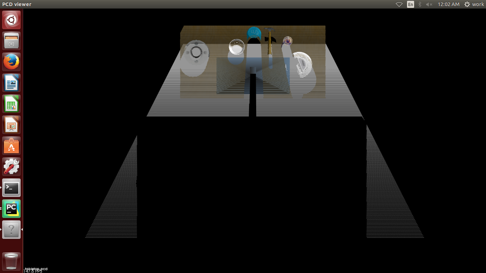
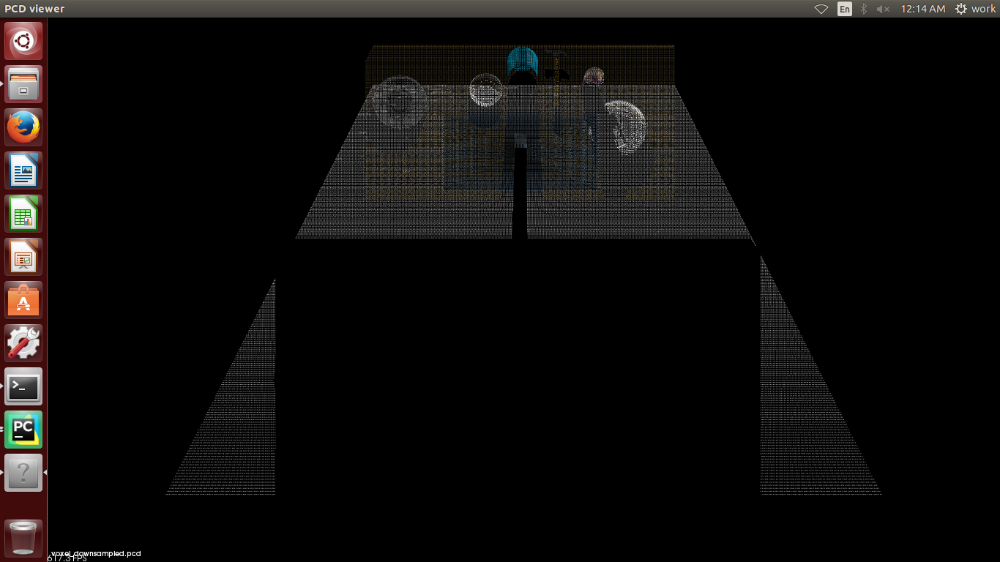
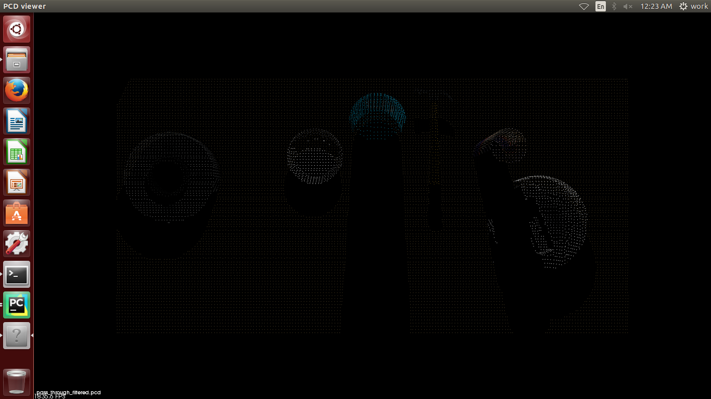
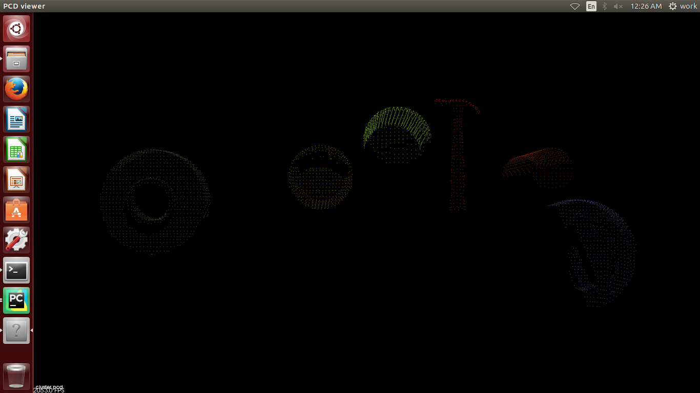
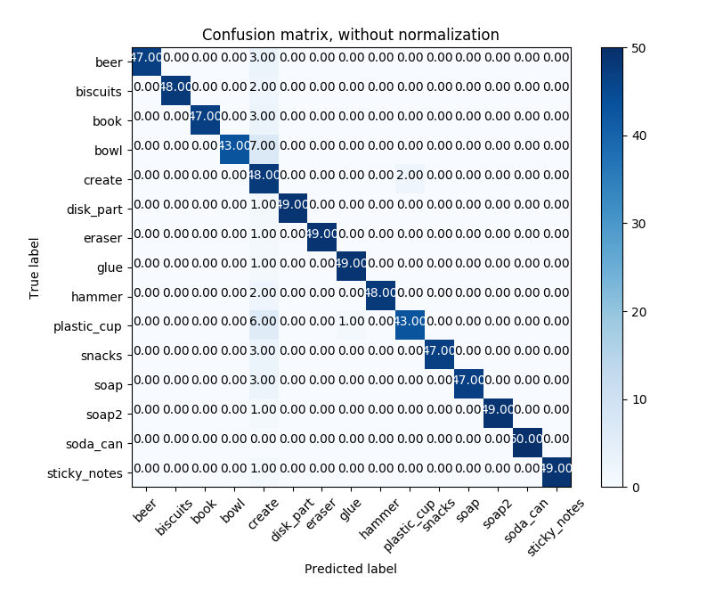

## Project: Perception Pick & Place


# Extra Challenges: Complete the Pick & Place
7. To create a collision map, publish a point cloud to the `/pr2/3d_map/points` topic and make sure you change the `point_cloud_topic` to `/pr2/3d_map/points` in `sensors.yaml` in the `/pr2_robot/config/` directory. This topic is read by Moveit!, which uses this point cloud input to generate a collision map, allowing the robot to plan its trajectory.  Keep in mind that later when you go to pick up an object, you must first remove it from this point cloud so it is removed from the collision map!
8. Rotate the robot to generate collision map of table sides. This can be accomplished by publishing joint angle value(in radians) to `/pr2/world_joint_controller/command`
9. Rotate the robot back to its original state.
10. Create a ROS Client for the “pick_place_routine” rosservice.  In the required steps above, you already created the messages you need to use this service. Checkout the [PickPlace.srv](https://github.com/udacity/RoboND-Perception-Project/tree/master/pr2_robot/srv) file to find out what arguments you must pass to this service.
11. If everything was done correctly, when you pass the appropriate messages to the `pick_place_routine` service, the selected arm will perform pick and place operation and display trajectory in the RViz window
12. Place all the objects from your pick list in their respective dropoff box and you have completed the challenge!
13. Looking for a bigger challenge?  Load up the `challenge.world` scenario and see if you can get your perception pipeline working there!

## [Rubric](https://review.udacity.com/#!/rubrics/1067/view) Points
### Here I will consider the rubric points individually and describe how I addressed each point in my implementation.  

---
### Writeup / README

### Exercise 1, 2 and 3 pipeline implemented
#### 1. Complete Exercise 1 and 2 steps. Pipeline for filtering, RANSAC plane fitting, segmentation, and clustering implemented.

Voxel downsampling, passthrough filtering, RANSAC plane segmentation, and Euclidean clustering were all performed on a 
sample pcl cloud data, in the aforementioned order.  The code can be found in 
```RoboND-Perception-Exercises/Exercise-1/RANSAC.py``` and the results are shown below. 

##### Original data



##### After voxel downsampling
This is done to reduce the total number of points on the scene to save on compute time and processing cycles.




##### After passthrough filtering
This is done with the intention of removing extraneous points that are unnecessary to our purposes.  In this instance, 
we are only interested in the table top and the obects found on top of it. 




##### After RANSAC plane segmentation
This is done to separate the table surface from the objects on the table surface.  We segment it by identifying the 
plane in the scene, and all the points that comprise it.  We also obtain all the points that do _not_ comprise this 
plane, which are basically our objects.

###### RANSAC plane inliers (table surface)


###### RANSAC plane outliers (non table-surface points)


##### After Euclidean clustering
This is done to group or cluster each point with a particular group.  The idea is that each point belongs to the cluster
that is closest to it, and that each cluster comprise an object of interest on top of the table.


##### Color coding clusters
We color code each point to show which cluster it belongs to




#### 2. Complete Exercise 3 Steps.  Features extracted and SVM trained.  Object recognition implemented.
For exercise 3, we: 
1. Generate training sets by capturing color and normal historgrams of objects.  The script used in this instance can be
found at `RoboND-Perception-Exercises/Exercise-3/sensor_stick/scripts/capture_features.py`. In this instance, we 
iterated 50 times for each object. The resultant training set can be found at 
`RoboND-Perception-Exercises/Exercise-3/sensor_stick/scripts/training_sets/training_set_complete_50.sav`. 
2. Once training sets have been generated, we proceed to train our models using these.  The training script used can be 
found at `RoboND-Perception-Exercises/Exercise-3/sensor_stick/scripts/train_svm.py` and the resulting model can be found 
at `RoboND-Perception-Exercises/Exercise-3/sensor_stick/scripts/models/model.sav`. The resultant confusion matrices are 
shown below

Confusion Matrix


Normalized Confusion Matrix


### Pick and Place Setup

#### 1. For all three tabletop setups (`test*.world`), perform object recognition, then read in respective pick list (`pick_list_*.yaml`). Next construct the messages that would comprise a valid `PickPlace` request output them to `.yaml` format.

The object recognition code can be found in
```
RoboND-Perception-Project/pr2_robot/scripts/object_recognition.py
```


The output yaml files are:

```
RoboND-Perception-Project/ros_independent_src/output_yaml/output_1.yaml
RoboND-Perception-Project/ros_independent_src/output_yaml/output_2.yaml
RoboND-Perception-Project/ros_independent_src/output_yaml/output_3.yaml
RoboND-Perception-Project/ros_independent_src/output_yaml/output_4.yaml
```

Most of the code has been lifted from the exercises.  The major departures from the exercises involve code dealing with the object recognition for the challenge world to generate output4.yaml.  The most notable of these differences involve the intensive use of passthrough filters for the challenge world, to ensure that there are no anomalous artifacts when segmenting objects. RANSAC plane segmentation was also not used in the challenge world. Instead, to obtain the pcl and ros cloud of the table surfaces for the challenge world, we created multiple passthrough filters that encompass the table surfaces,which we then combined later on. Below, we restate the different techniques we use, and some observations.  

1. Statistical outlier filtering (noise filtering) - for effective noise filtering, it seems it is best to do the filtering at the very beginning, even before doing voxed downsampling.  The algorithm has an easier time removing point cloud outliers when non-noise points are at their densest.
2. Voxel downsampling - for better object recognition effectivity, it may be best to have less downsampling. Although this will have to be balanced with the processing capacity of the host machine.  Point clouds that are too dense may consume too much processing cycles.
3. Passthrough filtering - Partitioning pointclouds using this technique, and recombining them later on, has proven to be a very handy tool in isolating areas of interest and removing artifacts. If the environment we are working with is fairly fixed, using passthrough filtering to reduce scene complexity is fairly effective.  The downside however is if the opposite were true, that is, if the environment is dynamic, and there are no static areas. In these instances, this method may instead "chop up" the point cloud in the wrong places. It may, however, be possible to programmatically and dynamically determine which areas to passthrough filter, so it may still have utility even if the environment is dynamic. 
4. RANSAC plane segmentation - the implementation from the exercises only allows for the segmentation of a single identified plane from a point cloud. For future implementations, we can explore how to identify and segment multiple planes from a single point cloud. We can also explore how segmentation of other geometric shapes can be done using this technique.
5. Euclidan Clustering
6. Histogram generation for color and shape(normals) features - an attempt was made to generate training sets based only on shape and colors of the objects.  Training sets using only the object colors was still able to produce a normalized confusion matrix with values greater than 90%.  On the other hand, training sets using only normals(shape) failed to produce workable results. This may have been caused by the limited number of "buckets" used, which was at 20.  Maybe larger values can produce better results.
7. Model generation using a Support Vector Machine - we used the rbf kernel, with the setting `probability=True`. The rbf kernel produced better results than the linear kernel.  With the `probability=True` setting, we are also able to check the degree of confidence of the performed object recognition.
8. Object recognition using the aforementioned model
9. Collision map generation - we use the clear_octomap service to periodically clear the collision map, and then repopulate it for each object.
10. Pick place operation - some config files were adjusted to try to get the arm to actually pick the objects.  Although it may be possible the cause of the objects "slipping" from the gripper is the fact that object orientation data is needed to be supplied, apart from the object position. Further refinement of place pose assignment could also be done.